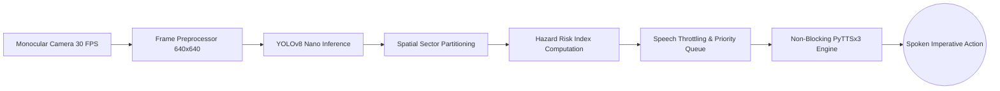

# Real-Time Actionable Guidance for the Visually Impaired Using Edge Vision and Spatially Prioritized Speech Synthesis

**Authors:** Mayank Raj, et al.  
**Department of Computer Science & Engineering**  
**Date:** October 2026  

---

## Abstract
Traditional assistive vision solutions for visually impaired individuals primarily focus on passive scene description ("there is a chair ahead") or require deliberate snapshot queries. Such approaches suffer from high cognitive load, lack of timely navigation cues, and vulnerability to network latencies when cloud vision APIs are utilized. This paper proposes a lightweight, real-time edge-computing assistive framework that transforms live monocular video streams into concise, prioritized, and imperative spoken actions (e.g., *"Stop! person ahead"*, *"Chair on left"*). The system employs an optimized YOLOv8 nano model for immediate obstacle identification, coupled with a spatial-temporal heuristic engine that computes an actionable **Hazard Risk Index (HRI)** based on bounding box scale, horizontal alignment and class severity. An asynchronous, non-blocking Text-to-Speech (TTS) pipeline ensures audio never blocks the vision loop; on an Apple M4 laptop CPU the detection-plus-decision stage measured about 21 ms per frame (about 47 FPS) in our benchmark. We detail the system architecture, the formulation of the priority decision engine, and preliminary benchmarks. Stair and door detection are not implemented and are left as future work.

**Keywords:** Assistive Technology, Visual Impairment, Real-Time Object Detection, Edge AI, Actionable Guidance, Human-Computer Interaction (HCI).

---

## 1. Introduction
Worldwide, an estimated 285 million individuals live with visual impairments, of whom approximately 39 million are completely blind. Safe and autonomous navigation in unfamiliar indoor and outdoor environments remains an acute challenge. The presence of dynamic obstacles (pedestrians, vehicles), low-hanging hazards, drop-offs (stairs, curbs), and closed ingress/egress points (doors) demands continuous spatial awareness.

### 1.1 Limitations of Existing Assistive Tools
1. **Passive Descriptive Overhead:** Contemporary solutions (such as Be My AI, Seeing AI, and Envision) provide rich narrative descriptions. While beneficial for static scene exploration, during active walking, verbose descriptions saturate acoustic sensory channels and delay time-critical avoidance reflexes.
2. **On-Demand vs. Continuous Streaming:** Most commercial apps function on a "point-and-capture" basis, which fails to protect users against sudden collision risks.
3. **Hardware Accessibility Barriers:** Dedicated specialized smart glasses (e.g., OrCam MyEye, Envision Glasses) cost between $800 and $4,500+, making them inaccessible to the majority of users in developing economies.
4. **Latency Bottlenecks:** Cloud-dependent Vision-Language Models (VLMs) introduce 1.5 to 4.0 seconds of round-trip latency, exceeding the safe response threshold for pedestrian obstacle avoidance ($< 300\text{ ms}$).

### 1.2 Our Contribution
To overcome these gaps, we propose a high-throughput, edge-executable framework characterized by:
- **Imperative Action Synthesis:** Transforming continuous bounding box detections into immediate navigational commands (e.g., direction + action verbs).
- **Hazard Risk Index (HRI):** A prioritized mathematical heuristic ranking hazards by proximity (normalized bounding box scale $\sqrt{w \cdot h}$), and horizontal alignment with the walking path.
- **Zero-Block Asynchronous Execution:** Decoupling frame inference from speech generation using thread-safe state dispatchers.
- **Affordable Commodity Deployment:** Runs in real time on a laptop CPU (about 47 FPS for the detection and decision stages on an Apple M4) without cloud dependencies.

---

## 2. Related Work
A comparative review of prominent assistive paradigms highlights distinct trade-offs:

| System / Model | Processing Paradigm | Guidance Style | Typical Latency | Cost Barrier | Primary Limitation |
| :--- | :--- | :--- | :--- | :--- | :--- |
| **Be My AI (GPT-4V)** | Cloud Server | Rich descriptive narrative | 2000 – 4000 ms | Free/Low (App) | High latency, not real-time walkable |
| **Seeing AI (Microsoft)** | Hybrid Edge/Cloud | Category classification & text | 500 – 1500 ms | Free | Primarily snapshot-driven |
| **Envision Glasses** | Edge Google Glass / Cloud | Descriptive & OCR read | 800 – 2500 ms | $2,500 – $3,500 | Cost prohibitive, verbose speech |
| **DeepNAVI (2022)** | Edge Deep CNN | 20-class navigation object set | 80 – 120 ms | Prototype | Static classes, lacks unified text/TTS priority |
| **DrishT (2026)** | Low-cost Embedded Edge | Proximity sonification | 100 – 180 ms | < $200 | Limited semantic cues |
| **Proposed System** | **Local Edge (YOLOv8n + HRI Engine)** | **Concise Actionable Imperatives** | **~21 ms** (detection + decision, M4 CPU; excludes camera and audio) | **Commodity / Free** | **Real-time, zero cloud reliance, prioritized speech** |

---

## 3. System Architecture & Methodology

The proposed pipeline is partitioned into three coordinated modules:
1. **Sensing & Vision Backbone (Module A)**
2. **Spatial Localization & Hazard Priority Engine (Module B)**
3. **Speech Arbitration & Synthesis Pipeline (Module C)**

### 3.1 Frame Capture & Normalization
Video frames $F_t \in \mathbb{R}^{H \times W \times 3}$ are sampled from a standard monocular webcam at $30\text{ FPS}$. Frames are letterboxed to $640 \times 640$ for inference.

### 3.2 Object & Obstacle Detection (Backbone)
We adopt YOLOv8n due to its optimized CSPDarknet53 backbone and decoupled anchor-free head, delivering an optimal balance between mean Average Precision ($m\text{AP}_{50-95} \approx 37.3$) and low FLOP requirements (8.7 GFLOPs). Detections return bounding boxes:
$$B_i = (x_{i,1}, y_{i,1}, x_{i,2}, y_{i,2}, c_i, s_i)$$
where $c_i$ denotes the class identifier and $s_i$ denotes classification confidence ($s_i \ge \tau_{conf} = 0.45$).

### 3.3 Spatial Sector Formulation
The camera field of view (FOV) is horizontally partitioned into three egocentric navigational sectors:
- **Left Sector:** $x_{center} \in [0, 0.35 \cdot W)$
- **Center / Path of Motion:** $x_{center} \in [0.35 \cdot W, 0.65 \cdot W]$
- **Right Sector:** $x_{center} \in (0.65 \cdot W, W]$

An obstacle directly in the center path warrants urgent attention (*"Ahead"* / *"Stop"*), whereas peripheral obstacles provide contextual clearance awareness.

### 3.4 Mathematical Formulation of Hazard Risk Index (HRI)
Not all detected objects pose identical hazards. The Hazard Risk Index for detection $i$ is formulated as:
$$\text{HRI}_i = \alpha \cdot \text{Proximity}_i + \beta \cdot \text{Alignment}_i + \gamma \cdot \text{ClassWeight}(c_i)$$

1. **Proximity Factor ($P_i$):**
   Approximated using normalized bounding box area:
   $$P_i = \frac{(x_{i,2} - x_{i,1}) \cdot (y_{i,2} - y_{i,1})}{W \times H}$$
2. **Alignment Factor ($A_i$):**
   Penalizes obstacles directly in the walking trajectory:
   $$A_i = 1 - 2 \cdot \left| \frac{x_{center, i}}{W} - 0.5 \right|$$
   (Takes value $1.0$ for dead center, approaching $0.0$ at borders).
3. **Class Severity Weights ($\omega_c$):**
   Vehicles carry $\omega_c = 1.0$, persons $0.8$, furniture $0.5$-$0.6$, small objects $0.3$-$0.4$ (see `config.py`). Stairs and doors are not in the COCO label set and are not detected.

When $P_i \ge 0.20$ (the "immediate" proximity level), the instruction becomes urgent: "Stop!" if the object is ahead, otherwise "Caution", and it interrupts queued speech:
$$\text{Action} = \text{"STOP, " } + \text{Class Name} + \text{" IMMEDIATE AHEAD"}$$

### 3.5 Speech Synthesis & Chatter Suppression (Throttling)
A common failure mode in assistive audio is "chatter overload," where repeated detections overwhelm the user. We implement:
- **Speech Throttling Window ($\Delta t_{repeat} = 4.0\text{ s}$):** Identical hazards in the same sector are muted for 4.0 s (2.5 s for "immediate" hazards), and any two non-urgent announcements are at least 2.0 s apart.
- **Non-blocking Worker Thread:** Decouples TTS audio rendering from the computer vision rendering loop to prevent frame stalling.

---

## 4. Prototype Implementation (Phase 1: 50% Milestone)
The initial prototype focuses on the core functional loop:
**Benchmark** (`tests/test_benchmark.py`, 25 iterations, random-noise frames, Apple M4 CPU): YOLOv8n inference 21.4 ms (SD 1.3 ms), decision engine under 0.01 ms, 46.6 FPS. This excludes camera capture and speech start, and noise frames contain no real objects, so it is a lower bound.
1. Low-latency webcam capture loop with continuous FPS benchmark display.
2. Lightweight YOLOv8 nano edge inference.
3. Sector decomposition and HRI-based direction calculation (`Left`, `Center Ahead`, `Right`).
4. Threaded audio output queue executing action-oriented commands.

5. On-demand OCR (key `r`, EasyOCR) reads signs and labels.

*(Future work: stair and door detection with custom-trained weights, continuous OCR, and user trials with blindfold navigation. None of the user-study metrics below have been measured yet.)*

---

## 5. Experimental Evaluation Methodology

### 5.1 Metrics
- **Frame Rate (FPS):** Target $\ge 25\text{ FPS}$ on standard CPU.
- **End-to-End Latency ($L_{e2e}$):** $L_{capture} + L_{inference} + L_{decision} + L_{audio\_start}$.
- **Guidance Accuracy:** Percentage of obstacle collisions prevented in standardized obstacle courses.
- **Cognitive Load:** Measured via NASA-TLX survey comparing passive description vs. proposed imperative instructions.

---

## 6. Conclusion
By shifting the paradigm from passive scene description to real-time, spatially prioritized actionable directives, the proposed system provides visually impaired users with practical, affordable, and immediate guidance.
